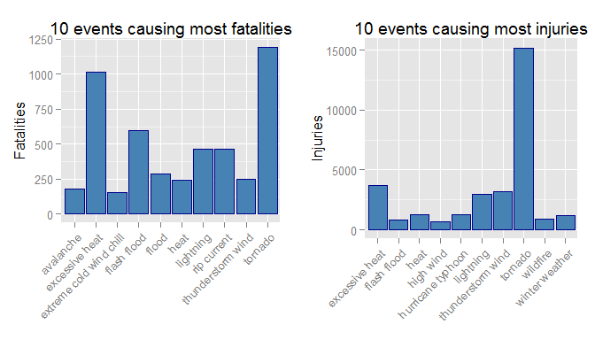

# Reproducible Research: Peer Assessment 2
#  Damage to poulation and economy from weather in the United States 

## Synopsis
I have used the Storm Data dataset provided by the National Weather Service to analyse which weather events are most harmful. The analysis looks at two aspectes of damage; damage to population health and economic damage. This analysis looks at damage from weather from year 2000-2011, identifying the events causing the largest numbers of fatalities and injuries as well as the events leading to the largest costs from property and crop damage. 

My analysis shows that the events that cause most population damage are excessive heat, tornados, floods and thunderstorm. 

When it comes to economic damage, floods cause by far the most damage when looking at all years. During 2011 tornados cause the most damage, but this pattern is not repeated for other years. 

## Data Processing
This study is based on the National Weather Services' Storm Data dataset, and can be downloaded from [here.](https://d396qusza40orc.cloudfront.net/repdata%2Fdata%2FStormData.csv.bz2) It includes data on damage from weather event in the United States from 1950 up to 2011. It is read and loaded to the variable *stormdata* Some documentation for the dataset can be found [here. ](https://d396qusza40orc.cloudfront.net/repdata%2Fpeer2_doc%2Fpd01016005curr.pdf)

```r
if (!file.exists("stormdata.csv.bz2")){
download.file("https://d396qusza40orc.cloudfront.net/repdata%2Fdata%2FStormData.csv.bz2","stormdata.csv.bz2", method = "curl")}
stormdata.full<- read.csv(bzfile("stormdata.csv.bz2"), header = TRUE, na.strings = "")
```

The data is processed in the following steps: 

1. Column names have been transformed to lower case 
2. Only the columns of the data concerning damage caused by weather, i.e. the ones needed for this analysis, are kept
3. The column *year* is added
4. A new column called *evtype_cleaned* is created, this contains the information from *evtype* modified in the following ways:
    + All event names are transformed to lower case and special characters and leading and trailing spaces are removed
    + Some common variations and abbrevations for events are replaced with a standard event name, e.g. "TSTM"" is replaced by "thunderstorm"
    + Similar events are grouped together, e.g. all event contained the word "flood" are mapped to the event type "floods (several types)" 
5. New columns with the calculated value of crop damage, property damage and total economic damage (crop and property damages combined) are added and stored in the columns *propdmgest*, *cropdmgest*, and *dmgest*.
6. The data is limited to data reported during year 2000 or later. The reason for this is twofold: 
    + Firstly, Events that took place more than ten years ago (relative to the last date of the dataset) is not relevant for assessing how to prevent damage from events that happened today. The measures we take to prevent damage from weather events have changed (and hopefully improved) greatly since the 1950s
    + We do not have as much data from the early years of the dataset as we have for the later years (see exploratory analysis), for example, the first reports of economic damage are from 1995. 


```r
library(dplyr)
```

```
## 
## Attaching package: 'dplyr'
## 
## The following objects are masked from 'package:stats':
## 
##     filter, lag
## 
## The following objects are masked from 'package:base':
## 
##     intersect, setdiff, setequal, union
```

```r
library(lubridate)
names(stormdata.full)<-tolower(names(stormdata.full))
stormdata.full$year <- year(as.Date(stormdata.full$bgn_date,"%m/%d/%Y"))
stormdata <- select(stormdata.full, evtype, fatalities, injuries, propdmg, propdmgexp, cropdmg, cropdmgexp, year)
stormdata <- filter(stormdata, year>=2000)
```

Processing of the event type:

```r
# remove special characters and trailing/leading spaces 
stormdata$evtype<-tolower(stormdata$evtype)
stormdata$evtype_cleaned<- gsub("[0-9]*[\\.\\(\\)]*","", stormdata$evtype)
stormdata$evtype_cleaned<- gsub("[-/:]"," ", stormdata$evtype_cleaned)
stormdata$evtype_cleaned<- gsub("^[ ]","",  stormdata$evtype_cleaned)
stormdata$evtype_cleaned<- sub("[ ]$", "", stormdata$evtype_cleaned)

# Replace the abbreviations and variations of event name with standard name
replace <- c("tstm", "winds", "storms", "flooding", "currents", "fires")
with    <- c("thunderstorm", "wind", "storm", "flood", "current", "fire")

for(i in seq_along(replace)){
    stormdata$evtype_cleaned<-gsub(replace[i], with[i], stormdata$evtype_cleaned, ignore.case = TRUE)
}
rm(i, replace, with)

# Rename events containing certain patterns 
pattern <- c("summary", "flood", "tide", "thunderstorm", "heat", "cold", "chill", "wild fire", "thunderstorm", "lightning", "winter weather", "hail")
newname <- c("summary", "flood (several types)", "tide (several types)", "thunderstorm", "heat (several types)", "cold (several types)", "wind chill", "wildfire", "thunderstorm/lightning", "thunderstorm/lightning", "winter weather", "hail")

for(i in seq_along(pattern)){
    stormdata$evtype_cleaned[grep(pattern[i],stormdata$evtype_cleaned,ignore.case = TRUE)]<-newname[i]
}
rm(i, pattern, newname)
```

Processing the values for the cost for crop and property damage: 

```r
# Assign a numeric value to the crop and property damage by translating the alphabetical magnuítudes to numeric values 
# Economic damage will be stored in million dollars
stormdata$propdmgexp<-tolower(stormdata$propdmgexp)
stormdata$cropdmgexp<-tolower(stormdata$cropdmgexp)

alphabetic <- c("k", "m", "b")
magnitude  <- c(0.001,1,1000)
stormdata$propdmgest <- 0;
stormdata$cropdmgest <- 0;

for(i in seq_along(alphabetic)){
    prop_ind <- which(stormdata$propdmgexp==alphabetic[i] & !is.na(stormdata$propdmg))
    stormdata$propdmgest[prop_ind] <-  magnitude[i]*stormdata$propdmg[prop_ind]
    
    crop_ind <- which(stormdata$cropdmgexp==alphabetic[i] & !is.na(stormdata$cropdmg))
    stormdata$cropdmgest[crop_ind] <-  magnitude[i]*stormdata$cropdmg[crop_ind]
}
stormdata$dmgest <- stormdata$cropdmgest+stormdata$propdmgest
rm(i,prop_ind,crop_ind,alphabetic,magnitude)
```

## Results
### Events causing population harm 
The data contains information on the number of fatalitites and injuries caused by the different types of weather. To assess how much harm each type of weather does I have counted the number of fatalities and injuries caused by each of the grouped weather types for the full data as well as restricted to the last year in the data. The rationale behind restricting the data to the last year is to better see which types of weather are problematic at the moment, and where efforts to prevent harm should be directed. 


```r
library(ggplot2)
library(gridExtra)

# sum fatalities and injuries by event type and sort to show events with most fatalities/injuries
rank.fatal    <- stormdata %>% group_by(evtype_cleaned) %>% summarize(fatal = sum(fatalities)) %>% top_n(10, fatal)
rank.recentfatal <- stormdata %>% filter(year>=2011) %>% group_by(evtype_cleaned) %>% summarize(rec_fatal = sum(fatalities)) %>% top_n(10, rec_fatal)
rank.injuries <- stormdata %>% group_by(evtype_cleaned) %>% summarize(injuries = sum(injuries)) %>% top_n(10, injuries)
rank.recentinjuries <- stormdata %>% filter(year>=2011) %>% group_by(evtype_cleaned) %>% summarize(rec_injuries = sum(injuries)) %>% top_n(10, rec_injuries)

labeltheme <- theme(axis.text.x = element_text(angle = 45, hjust = 1), axis.title.x = element_blank())
geomstyle  <- geom_bar(stat="identity", fill="steelblue", col="darkblue")

g1 <- ggplot(data=rank.fatal, aes(x=evtype_cleaned, y=fatal)) + geomstyle + ggtitle("10 events causing most fatalities")+labeltheme
g2 <- ggplot(data=rank.recentfatal, aes(x=evtype_cleaned, y=rec_fatal)) + geomstyle + ggtitle("Restricted to 2011 data")+labeltheme

g3 <- ggplot(data=rank.injuries, aes(x=evtype_cleaned, y=injuries)) + geomstyle + ggtitle("10 events causing most injuries")+labeltheme
g4 <- ggplot(data=rank.recentinjuries, aes(x=evtype_cleaned, y=rec_injuries)) + geomstyle + ggtitle("Restricted to 2011 data")+labeltheme

grid.arrange(g1, g2, g3, g4, nrow=2, ncol=2)
```

 

These graphs show the 10 events with the largest number of fatalities or injuries for the full data and when restricting the data to 2011. From the graphs we can see that tornados cause the largest number of injuries and also a large number of fatalities. The biggest cause of fatalitites for data from 2000-2011 is excessive heat which causes a slightly larger number of deaths. Other large causes of fatalitites and injuries are floods, excessive heat, and rip currents.   

It can be noted that there is a large number of injuries and fatalites form tornados in 2011. Some [wikipedia reserach](https://en.wikipedia.org/wiki/April_25%E2%80%9328,_2011_tornado_outbreak) shows that this is due to an exceptionally large number of tornado outbreaks in the US in 2011

### Events with greatest economic consequences 

I have summed the damage to properties and the damage to crops to get the total amount of economic damage. The distribution of total economic damage by event is shown in the plots below. 


```r
# sum economic damage by event type and sort to show events with greatest economic consequences 
rank.tot <- stormdata %>% na.omit() %>% group_by(evtype_cleaned) %>% summarize(dmgest = sum(dmgest)) %>% top_n(10, dmgest)
rank.recenttot <- stormdata %>% na.omit() %>% filter(year>=2011) %>% group_by(evtype_cleaned) %>% summarize(dmgest = sum(dmgest)) %>% top_n(10, dmgest)

g1 <- ggplot(data=rank.tot, aes(x=evtype_cleaned, y=dmgest)) + geomstyle + ggtitle("Total damage by event type")+ylab("Damage in million $")+labeltheme
g2 <- ggplot(data=rank.recenttot, aes(x=evtype_cleaned, y=dmgest)) + geomstyle + ggtitle("Restricted to 2011 data")+ylab("")+labeltheme

grid.arrange(g1, g2, nrow=1, ncol=2)
```

 


From these plots we see that the event causing the largest damage in million dollars is floods followed by hurricane typhoons and tornados. If we only look at 2011 the pattern is different, with tornados being the largest source of economic damage, closely followed by floods. 

## Discussion and conclusions 
The results from this analysis indicates that the events causing most damage (both economical and to the population) are tornados, floods and heat spells. Efforts for preventing weather related damage should be focused on these types of events. 


## Appendix; Exploratory analysis 
Here are some exploratory searches I performed to better understand the data. They are available for reference (and for my own sake), but are not essential in understanding and interpreting the analysis and results. Please fell free to ignore. 


```r
names(stormdata)
```

```
##  [1] "evtype"         "fatalities"     "injuries"       "propdmg"       
##  [5] "propdmgexp"     "cropdmg"        "cropdmgexp"     "year"          
##  [9] "evtype_cleaned" "propdmgest"     "cropdmgest"     "dmgest"
```

```r
summary(stormdata)
```

```
##     evtype            fatalities           injuries       
##  Length:523163      Min.   :  0.00000   Min.   :0.00e+00  
##  Class :character   1st Qu.:  0.00000   1st Qu.:0.00e+00  
##  Mode  :character   Median :  0.00000   Median :0.00e+00  
##                     Mean   :  0.01146   Mean   :6.72e-02  
##                     3rd Qu.:  0.00000   3rd Qu.:0.00e+00  
##                     Max.   :158.00000   Max.   :1.15e+03  
##     propdmg         propdmgexp           cropdmg         cropdmgexp       
##  Min.   :   0.00   Length:523163      Min.   :  0.000   Length:523163     
##  1st Qu.:   0.00   Class :character   1st Qu.:  0.000   Class :character  
##  Median :   0.00   Mode  :character   Median :  0.000   Mode  :character  
##  Mean   :  11.41                      Mean   :  1.708                     
##  3rd Qu.:   1.00                      3rd Qu.:  0.000                     
##  Max.   :5000.00                      Max.   :990.000                     
##       year      evtype_cleaned       propdmgest         cropdmgest      
##  Min.   :2000   Length:523163      Min.   :0.00e+00   Min.   :0.00e+00  
##  1st Qu.:2003   Class :character   1st Qu.:0.00e+00   1st Qu.:0.00e+00  
##  Median :2006   Mode  :character   Median :0.00e+00   Median :0.00e+00  
##  Mean   :2006                      Mean   :6.30e-01   Mean   :4.51e-02  
##  3rd Qu.:2009                      3rd Qu.:0.00e+00   3rd Qu.:0.00e+00  
##  Max.   :2011                      Max.   :1.15e+05   Max.   :1.51e+03  
##      dmgest        
##  Min.   :0.00e+00  
##  1st Qu.:0.00e+00  
##  Median :0.00e+00  
##  Mean   :6.80e-01  
##  3rd Qu.:0.00e+00  
##  Max.   :1.15e+05
```

```r
# which events are most common?
stormdata.common <- stormdata %>% count(evtype_cleaned)
stormdata.common[order(stormdata.common$n, decreasing = TRUE),]
```

```
## Source: local data frame [145 x 2]
## 
##            evtype_cleaned      n
##                     (chr)  (int)
## 1  thunderstorm/lightning 188546
## 2                    hail 166200
## 3   flood (several types)  61192
## 4                 tornado  17687
## 5               high wind  16411
## 6              heavy snow  10901
## 7            winter storm   9774
## 8              heavy rain   9664
## 9          winter weather   8040
## 10           funnel cloud   4637
## ..                    ...    ...
```

```r
# sum fatalities by event type and sort to show events with most fatalities
stormdata.fatal <- stormdata %>% group_by(evtype_cleaned) %>% summarize(fatalities = sum(fatalities))
stormdata.fatal[order(stormdata.fatal$fatalities, decreasing = TRUE),]
```

```
## Source: local data frame [145 x 2]
## 
##            evtype_cleaned fatalities
##                     (chr)      (dbl)
## 1    heat (several types)       1244
## 2                 tornado       1193
## 3   flood (several types)        870
## 4  thunderstorm/lightning        735
## 5             rip current        462
## 6    cold (several types)        259
## 7               avalanche        179
## 8               high wind        131
## 9            winter storm        104
## 10            strong wind        100
## ..                    ...        ...
```

```r
# sum fatalities by event type and sort to show events with most fatalities
stormdata.injur <- stormdata %>% group_by(evtype_cleaned) %>% summarize(injuries = sum(injuries))
stormdata.injur[order(stormdata.injur$injuries, decreasing = TRUE),]
```

```
## Source: local data frame [145 x 2]
## 
##            evtype_cleaned injuries
##                     (chr)    (dbl)
## 1                 tornado    15213
## 2  thunderstorm/lightning     6218
## 3    heat (several types)     4930
## 4       hurricane typhoon     1275
## 5   flood (several types)     1129
## 6                wildfire      911
## 7               high wind      677
## 8                    hail      545
## 9          winter weather      483
## 10           winter storm      436
## ..                    ...      ...
```

```r
# properties of the property and crop damage columns
summary(stormdata$propdmg)
```

```
##    Min. 1st Qu.  Median    Mean 3rd Qu.    Max. 
##    0.00    0.00    0.00   11.41    1.00 5000.00
```

```r
summary(stormdata$cropdmg)
```

```
##    Min. 1st Qu.  Median    Mean 3rd Qu.    Max. 
##   0.000   0.000   0.000   1.708   0.000 990.000
```

```r
summary(stormdata$propdmgexp)
```

```
##    Length     Class      Mode 
##    523163 character character
```

```r
summary(stormdata$cropdmgexp)
```

```
##    Length     Class      Mode 
##    523163 character character
```

```r
# economic damage from tornados over time
tornado <- stormdata %>% na.omit() %>% filter(evtype_cleaned=="tornado") %>% group_by(year, evtype_cleaned) %>% summarize(dmgest = sum(dmgest))%>% top_n(10, dmgest)
```

Some plots for which output is hidden to not exceed the limit of three plots


```r
# How many records per year do we have?
# Reporting seem to be taking of by 1995
plot(stormdata.full %>% count(year), pch=19)+abline(v=1995)

# no records of crop or prop damage before 95
plot(stormdata.full %>% group_by(year) %>%  summarise(dmg = sum(cropdmg)))
plot(stormdata.full %>% group_by(year) %>%  summarise(dmg = sum(propdmg)))

plot(stormdata.full %>% group_by(year) %>%  summarise(dmg = sum(fatalities)))
plot(stormdata.full %>% group_by(year) %>%  summarise(dmg = sum(injuries)))
```

